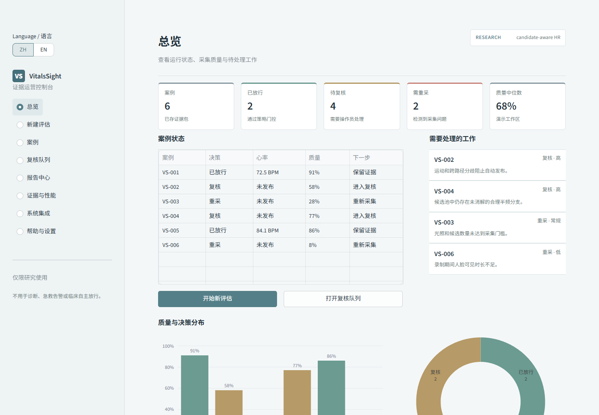

# VitalsSight

Research code for candidate-aware, camera-based heart-rate estimation with an explicit release/review output contract.

VitalsSight preserves multiple heart-rate hypotheses from classical, regional and learned routes, compares candidate-level and cross-candidate evidence, and returns either an estimate with an evidence packet or a review state. The repository accompanies the manuscript *VitalsSight selects competing heart rate candidates and documents failure modes*.

## Scope

This release contains:

- classical rPPG and ROI signal-processing utilities;
- multi-ROI candidate clustering and physiology-aware evidence features;
- candidate selection, correction and release/review policy code;
- protocol-aligned selector, ablation and cross-domain experiment entry points;
- participant-cluster bootstrap and subject-disjoint risk-audit scripts;
- partial runtime profiling and the Streamlit research interface;
- a local, evidence-bounded Qwen assistant with typed, voice and image input, deterministic fallback, and explicit action confirmation;
- protocol descriptors and aggregate manuscript metrics.

This release does **not** contain raw videos, identifiable participant frames, third-party datasets, third-party repositories, model checkpoints, private paths, credentials or internal execution logs. The pinned MediaPipe Face Landmarker runtime asset is installed separately from Google's official model host and verified by SHA256. Dataset access remains governed by the original providers. The software is a research artifact and is not a medical device or a validated autonomous clinical-release system.

## Installation

Python 3.10, 3.11, or 3.12 is supported. The product-console QA described below was run on Python 3.12.

```bash
python -m venv .venv
# Windows: .venv\Scripts\activate
# Linux/macOS: source .venv/bin/activate
python -m pip install --upgrade pip
pip install -r requirements-core.txt
```

Node.js 20 or later is needed only for the committed Playwright browser-validation harness; the application itself does not require Node.js.

Optional deep-learning dependencies are listed in `requirements-deep.txt` and `requirements-torch-cu128.txt`. Install a PyTorch build appropriate for the local CUDA runtime before installing optional deep components.

## Product console

The default Streamlit entry point is a complete research-product workflow with role-based operation guides, video-quality qualification, explicit release/review/retake states, a persistent review queue, evidence attribution, versioned PDF/JSON/Markdown/CSV reports, protocol-bound metrics, and an integration surface. Each non-release report connects the triggering signal and observed value to its policy target, recommended action, verification criterion, and escalation path; every exercised command returns visible feedback.



```bash
python scripts/setup_runtime_assets.py
streamlit run app/streamlit_app.py
```

The setup command downloads the official MediaPipe Face Landmarker bundle to the ignored `runtime/models` directory and verifies SHA256 `64184e229b263107bc2b804c6625db1341ff2bb731874b0bcc2fe6544e0bc9ff`. Use `--source /path/to/face_landmarker.task` for an offline authorized copy. Runtime initialization independently verifies the same hash. If the model is unavailable or fails integrity verification, the pipeline records `static_roi_fallback`; fallback evidence is never release eligible and is returned only with an explicit review action.

The accompanying REST API uses the same SQLite evidence and audit store:

```bash
uvicorn app.api_server:app --host 127.0.0.1 --port 8010
```

Submit a consented research video through the same quality-first workflow:

```bash
curl -X POST http://127.0.0.1:8010/api/v1/assessments/video \
  -F "file=@adult_face_video.mp4" \
  -F "consent_recorded=true" \
  -F "purpose=workflow_validation" \
  -F "retention_policy=delete_after_analysis" \
  -F "actor=research-operator"
```

The endpoint returns `release`, `review`, or `retake`. Only `release` may contain `released_hr_bpm`; the raw upload is deleted after processing. Interactive API documentation is available at `http://127.0.0.1:8010/docs` while the API is running. The product boundary remains research-only: the console does not claim live clinical monitoring, emergency alerting, autonomous clinical release, production identity/access management, or medical-device readiness.

The previous experiment-heavy dashboard is retained at `app/legacy_research_dashboard.py` for provenance, but it is no longer the default product surface. See [docs/PRODUCT_BENCHMARK_AND_COMPLETION.md](docs/PRODUCT_BENCHMARK_AND_COMPLETION.md) for the official-source product benchmark and implemented workflow contract.

## Local evidence assistant

The AI assistant is an optional local explanation and workflow layer. It accepts typed questions, locally transcribed voice, and bounded image context; retrieves case/report evidence; explains release/review/retake; locates quality failures; summarizes reports; navigates the console; and can prepare a review update that remains inert until a reviewer explicitly confirms it. The assistant cannot estimate or change HR from media, override the gate, access raw video, identify a person, diagnose, prescribe, or provide emergency guidance. If a model is unavailable, deterministic evidence guidance and modality-specific fallbacks remain available without changing the underlying VitalsSight workflow.

Install Ollama separately, then prepare the CPU-friendly local model and start the complete product:

```powershell
.\.venv\Scripts\python.exe scripts\setup_local_assistant.py --model qwen3:4b
.\.venv\Scripts\python.exe -m pip install -r requirements-multimodal.txt
.\.venv\Scripts\python.exe scripts\setup_multimodal_assistant.py --vision-model qwen3-vl:4b-instruct --asr-model small
powershell.exe -NoProfile -ExecutionPolicy Bypass -File .\scripts\start_vitalssight_with_assistant.ps1
```

Voice is converted to an editable transcript with faster-whisper. Images are normalized without metadata and analyzed by `qwen3-vl:4b-instruct`; only hash-bound, non-authoritative context enters chat. Raw audio and image bytes are not retained. Use `-EnableReviewActions` only in a controlled reviewer test; every proposed update still requires a second confirmation. See [docs/MULTIMODAL_ASSISTANT.md](docs/MULTIMODAL_ASSISTANT.md), [docs/LOCAL_ASSISTANT_SETUP.md](docs/LOCAL_ASSISTANT_SETUP.md), [docs/ASSISTANT_PRODUCT_AND_SAFETY_SPEC.md](docs/ASSISTANT_PRODUCT_AND_SAFETY_SPEC.md), and [docs/CONTROLLED_PILOT_GUIDE.md](docs/CONTROLLED_PILOT_GUIDE.md).

Use isolated state for QA or a controlled pilot so that test review actions cannot alter the normal local workspace:

```powershell
powershell.exe -NoProfile -ExecutionPolicy Bypass -File .\scripts\start_vitalssight_with_assistant.ps1 `
  -UiPort 8502 -ApiPort 8011 `
  -DbPath output\controlled_pilot\state.db `
  -UploadDir output\controlled_pilot\uploads
```

The configured model tag must exist exactly in `ollama list`. On the validation workstation, local `qwen3:4b` responses took roughly 15-51 seconds on the exercised CPU paths; latency is hardware- and prompt-dependent and is not an end-to-end real-time claim. A provider timeout, missing model, or malformed answer activates the evidence-bounded deterministic fallback without changing the measurement, gate, report, or review services.

The committed golden set contains 240 bilingual, four-role scenarios:

```bash
python scripts/run_assistant_eval.py --mode deterministic --output-dir output/assistant_eval
python scripts/run_assistant_eval.py --mode live --max-cases 24 --stride 5 --output-dir output/assistant_eval_live
```

The final functional and visual verification record is in [docs/PRODUCT_QA_REPORT.md](docs/PRODUCT_QA_REPORT.md). The finite command-by-command coverage contract is recorded in [docs/PRODUCT_FUNCTION_MATRIX_20260715.md](docs/PRODUCT_FUNCTION_MATRIX_20260715.md).

The frozen real-video backend/API replay and the real-browser workflow are reproducible with the committed validation harnesses:

```bash
python scripts/run_real_video_product_validation.py --manifest validation/real_video_case_manifest.json --fixture-root /authorized/fixture/root --output-dir output/real_video_product_validation --repeats 2 --require-clean
npm ci
npx playwright install chromium
node scripts/validate_browser_product.mjs http://127.0.0.1:8501 http://127.0.0.1:8010 /authorized/fixture/root output/browser_validation $(git rev-parse HEAD)
```

The browser harness expects the Streamlit console and REST API to be running and uses a fresh database/upload directory supplied through `VITALSSIGHT_DB_PATH` and `VITALSSIGHT_UPLOAD_DIR`. The private fixtures are not distributed by this repository.

## Quick check

The public example exercises label-free ROI candidate aggregation and the release/review contract without downloading a dataset:

```bash
python examples/candidate_release_demo.py
python -m pytest -q
```

## Dataset configuration

Datasets are never downloaded by the code automatically. Set one of these environment variables to a provider-authorized local directory:

```bash
CONTACTLESS_DATA_ROOT=/path/to/datasets
ADULT_DATA_ROOT=/path/to/datasets/adult
```

See [docs/DATA.md](docs/DATA.md) for the dataset boundary and [docs/REPRODUCIBILITY.md](docs/REPRODUCIBILITY.md) for the experiment map.

## Manuscript experiment map

| Manuscript component | Public entry point |
|---|---|
| Candidate and ROI evidence | `src/selection/roi_evidence.py` |
| Release/review contract | `src/selection/release_policy.py` |
| Protocol-aligned UBFC-rPPG selector | `scripts/run_t467_ubfc_protocol_aligned_candidate_selector.py` |
| Route-aware selector protocol | `scripts/run_t509_route_aware_gpu_selector_locked_protocol.py` |
| Harmonic-aware selector and rescue | `scripts/run_t730_harmonic_aware_selector.py`, `scripts/run_t731_candidate_ranker_harmonic_rescue.py` |
| Selector ablation | `scripts/run_t732_t731_bootstrap_ablation.py` |
| Multi-seed replication | `scripts/run_t750_external_selector_multiseed_replication.py`, `scripts/run_t753_rule_guided_neural_selector_multiseed.py` |
| Participant-cluster bootstrap | `scripts/run_t901_subject_cluster_bootstrap.py` |
| Subject-disjoint risk audit | `scripts/run_t902_subject_disjoint_risk_control.py` |
| Partial runtime profile | `scripts/run_t913_isolated_runtime_profile.py` |

The numbered filenames are retained to preserve the provenance of the executed project. They are mapped to manuscript concepts above so readers do not need the internal task history.

## Evidence boundaries

The primary retained internal estimate uses 42 UBFC-rPPG participants, 439 windows and model seeds 704, 1704 and 2704. The reported across-seed dispersion is not participant-level uncertainty. Risk-coverage analyses are exploratory and did not establish beneficial abstention or a participant-level guarantee. Protocol-specific stress results must not be pooled across datasets or statistical units. See `reproducibility/` for the machine-readable summary.

## Repository structure

```text
app/                 Streamlit research interface
configs/             Public policy and experiment configurations
docs/                Data and reproducibility documentation
examples/            Dataset-free executable example
reproducibility/     Protocol and aggregate metric summaries
scripts/             Manuscript-linked experiment entry points
src/                 Reusable signal, vision, selection and product modules
tests/               Public contract and leakage checks
```

## Citation and availability

The manuscript citation will be added after publication. Until then, cite the repository URL and commit SHA used for an analysis. A tagged archival release and DOI should replace the mutable branch URL in the final accepted manuscript.

No software license is granted by publication of this repository unless a `LICENSE` file is added by the authors. Copyright remains with the project authors.

The bundled OpenCV face-cascade data file retains its upstream license header. See [THIRD_PARTY_NOTICES.md](THIRD_PARTY_NOTICES.md).
