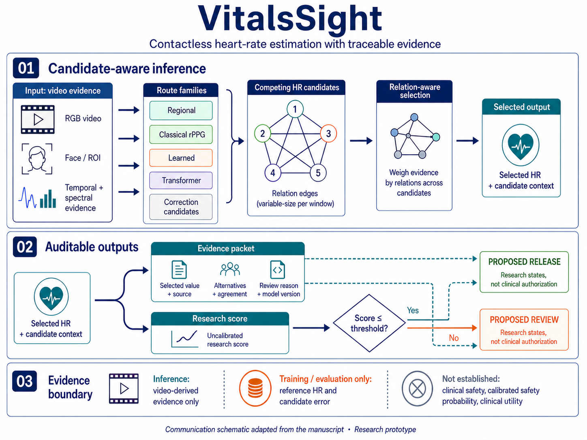
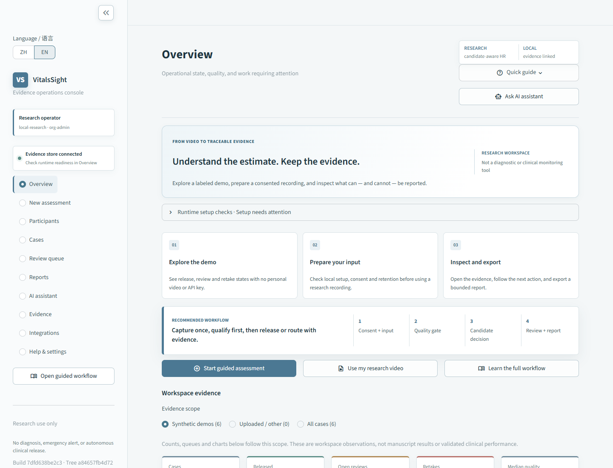

# VitalsSight

Research code for candidate-aware, camera-based heart-rate estimation with an explicit release/review output contract.

**Manuscript status:** Accepted for publication in *npj Cardiovascular Health*, as reported by the authors on 6 September 2026. An online publication date, journal article URL and DOI are not asserted here. The public code is a research artifact, not a validated clinical system.

**[Project website](https://shikiryo1.github.io/VitalsSight-candidate-aware-rPPG/)** | **[Author manuscript (PDF)](docs/manuscript/VitalsSight_NPJ_DM_manuscript.pdf)** | **[Editable Figure 1](docs/manuscript/VitalsSight_Figure1_v50_Evidence_Compass_Provenance_editable.pptx)** | **[Native macOS downloads](https://github.com/ShikiRyo1/VitalsSight-candidate-aware-rPPG/releases/tag/v0.2.0-macos.1)** | **[Extended audit package](reproducibility/v32_submission/)** | **[Data boundary](docs/DATA.md)**

VitalsSight is a candidate-aware supervised framework for camera-based heart-rate monitoring. It retains competing pulse candidates from regional, classical, learned, transformer and optional correction routes before relation-aware selection, then reports the selected heart rate, its evidence packet and a proposed release/review state as separate outputs. The repository accompanies the author manuscript *VitalsSight: A Candidate-Aware Framework and Auditable Output Contract for Contactless Heart Rate Monitoring*.

[](docs/assets/project-page/method-overview-social-20260906.png)

Communication schematic adapted from manuscript Figure 1; not a quantitative result. It separates candidate construction and selection from the evidence packet, research score and proposed output state. The [earlier V50 figure and editable source](docs/manuscript/README.md) remain archived for provenance; neither illustration changes the manuscript equations or results.

## Start here

- **Try the console:** follow the [first 10 minutes guide](docs/GETTING_STARTED.md), starting with clearly labeled examples before using an authorized video.
- **Understand the research:** read the manuscript and the evidence boundaries below.
- **Inspect the software contract:** run the dataset-free synthetic example under [Quick check](#quick-check). It demonstrates state routing, not the trained model's accuracy.
- **Reproduce scientific results:** first read [the reproducibility status](docs/REPRODUCIBILITY.md). Provider-authorized data, participant-linked intermediate ledgers and model checkpoints are not bundled; this clone is not a complete end-to-end reproduction package.

The practical problem is not only obtaining a heart-rate estimate, but preserving enough evidence to inspect an ambiguous result. VitalsSight explores that problem through traceable candidate selection and a review-oriented research workflow. Prospective clinical utility and beneficial abstention remain unestablished.

## Quick start

### Windows

```powershell
python -m venv .venv
.\.venv\Scripts\Activate.ps1
python -m pip install --upgrade pip
pip install -r requirements-core.txt
python scripts/setup_runtime_assets.py
python scripts/run_vitalssight_local.py
```

### macOS

For reviewer delivery, download the tested native `.app` package from the [macOS 0.2.0 release](https://github.com/ShikiRyo1/VitalsSight-candidate-aware-rPPG/releases/tag/v0.2.0-macos.1): choose `AppleSilicon` for Apple M-series Macs or `Intel` for older Intel Macs. The native package includes its runtime and does not require a local Python installation or a connection to the author's computer. Extract the ZIP completely; on first launch, Control-click `VitalsSight.app`, choose **Open**, and confirm **Open**. See [the native macOS delivery guide](docs/MACOS_NATIVE_APP_DELIVERY.md).

For source-based development, install Python 3.10-3.12, download and extract the complete repository, then double-click:

```text
RUN_VITALSSIGHT_MAC.command
```

The launcher creates an isolated environment, installs the declared dependencies, verifies the pinned runtime asset and opens the local browser interface. See [the macOS instructions](docs/MACOS_QUICK_START.md) for Gatekeeper-safe opening and log locations.

## Scope

This release contains:

- classical rPPG and ROI signal-processing utilities;
- multi-ROI candidate clustering and physiology-aware evidence features;
- candidate selection, correction and release/review policy code;
- protocol-aligned selector, ablation and cross-domain experiment entry points;
- participant-cluster bootstrap and subject-disjoint risk-audit scripts;
- partial runtime profiling and the Streamlit research interface;
- a local, evidence-bounded AI assistant with typed, voice, image, and consented-video input, deterministic fallback, inline workflow reports, and explicit action confirmation;
- protocol descriptors and aggregate manuscript metrics.

This release does **not** contain raw videos, identifiable participant frames, third-party datasets, third-party repositories, model checkpoints, private paths, credentials or internal execution logs. The pinned MediaPipe Face Landmarker runtime asset is installed separately from Google's official model host and verified by SHA256. Dataset access remains governed by the original providers. The software is a research artifact and is not a medical device or a validated autonomous clinical-release system.

## Installation

Python 3.10, 3.11, or 3.12 is supported. The product-console QA described below was run on Python 3.12.

```bash
python -m venv .venv
# Windows: .venv\Scripts\activate
# Linux/macOS: source .venv/bin/activate
python -m pip install --upgrade pip
pip install -r requirements-core.txt
```

Node.js 20 or later is needed only for the committed Playwright browser-validation harness; the application itself does not require Node.js.

Optional deep-learning dependencies are listed in `requirements-deep.txt` and `requirements-torch-cu128.txt`. Install a PyTorch build appropriate for the local CUDA runtime before installing optional deep components.

## Product console

The default Streamlit entry point is a complete research-product workflow with OIDC-ready organization/role scoping, pseudonymous participant and consent management, role-based operation guides, video-quality qualification, explicit release/review/retake states, a persistent review queue, evidence attribution, governed report versions, longitudinal state context, PDF/JSON/Markdown/CSV/FHIR exports, protocol-bound metrics, and an integration surface. Each non-release report connects the triggering signal and observed value to its policy target, recommended action, verification criterion, and escalation path; every exercised command returns visible feedback.



The [September source update](docs/RELEASE_NOTES_20260906.md) adds guided onboarding, local readiness diagnostics, shared UI/API upload checks and participant/consent-bound preview invalidation. The screenshot uses synthetic demonstrations; it is not a participant result or clinical evidence. The previously published native macOS packages have not been rebuilt for this source update.

```bash
python scripts/setup_runtime_assets.py
streamlit run app/streamlit_app.py
```

The setup command downloads the official MediaPipe Face Landmarker bundle to the ignored `runtime/models` directory and verifies SHA256 `64184e229b263107bc2b804c6625db1341ff2bb731874b0bcc2fe6544e0bc9ff`. Use `--source /path/to/face_landmarker.task` for an offline authorized copy. Runtime initialization independently verifies the same hash. If the model is unavailable or fails integrity verification, the pipeline records `static_roi_fallback`; fallback evidence is never release eligible and is returned only with an explicit review action.

The accompanying REST API uses the same SQLite evidence and audit store:

```bash
uvicorn app.api_server:app --host 127.0.0.1 --port 8010
```

Submit a consented research video through the same quality-first workflow:

```bash
curl -X POST http://127.0.0.1:8010/api/v1/assessments/video \
  -F "file=@adult_face_video.mp4" \
  -F "consent_recorded=true" \
  -F "purpose=workflow_validation" \
  -F "retention_policy=delete_after_analysis" \
  -F "actor=research-operator"
```

The endpoint returns `release`, `review`, or `retake`. Only `release` may contain `released_hr_bpm`; the raw upload is deleted after processing. Interactive API documentation is available at `http://127.0.0.1:8010/docs` while the API is running. The product boundary remains research-only: the console does not claim live clinical monitoring, emergency alerting, autonomous clinical release, hardened public hosting, regulatory certification, or medical-device readiness. Required-auth mode provides verified OIDC identity, role and organization scoping for a supervised single-instance controlled trial; it is not a substitute for an infrastructure and security review.

### Controlled-trial identity and report governance

Local development uses an explicitly labelled development identity. A multi-user controlled trial must set `VITALSSIGHT_AUTH_MODE=required`, configure `.streamlit/secrets.toml`, and provide issuer/audience/JWKS values from an OIDC provider. The API verifies signed bearer tokens; the UI and store enforce organization and participant scope. Roles remain managed by the identity provider rather than by application passwords.

Reports are audience-specific and content-hashed. An optional local model may draft an evidence-cited explanation, but strict validation and reviewer approval remain mandatory. Model failure produces a labelled deterministic fallback. Only release cases generate an HR `Observation` in FHIR; review and retake generate a `Task` with HR withheld.

Operational guidance is in [docs/CONTROLLED_TRIAL_OPERATIONS.md](docs/CONTROLLED_TRIAL_OPERATIONS.md), the threat/data model is in [docs/PRIVACY_SECURITY_MODEL.md](docs/PRIVACY_SECURITY_MODEL.md), report/FHIR rules are in [docs/REPORT_GOVERNANCE_AND_FHIR.md](docs/REPORT_GOVERNANCE_AND_FHIR.md), the final finite acceptance record is in [docs/CONTROLLED_TRIAL_PRODUCT_QA_20260717.md](docs/CONTROLLED_TRIAL_PRODUCT_QA_20260717.md), and the deliberately separate native-app/multi-instance continuation is in [docs/NATIVE_APP_AND_SCALE_ROADMAP.md](docs/NATIVE_APP_AND_SCALE_ROADMAP.md).

The previous experiment-heavy dashboard is retained at `app/legacy_research_dashboard.py` for provenance, but it is no longer the default product surface. See [docs/PRODUCT_BENCHMARK_AND_COMPLETION.md](docs/PRODUCT_BENCHMARK_AND_COMPLETION.md) for the official-source product benchmark and implemented workflow contract.

## Local evidence assistant

The AI assistant is an optional local explanation and controlled workflow layer. Its unified workspace accepts typed questions, locally transcribed voice, bounded image context, and a consented video. A video request invokes the same deterministic assessment, release/review/retake gate, evidence store, action-plan builder, and report service used elsewhere in the product, then returns the state, explanation, next action, and PDF/JSON/Markdown/CSV/FHIR exports in the same interface. The assistant can retrieve case/report evidence, locate quality failures, navigate the console, and prepare a review update that remains inert until a reviewer explicitly confirms it. It cannot estimate or change HR from conversational media, override the gate, bypass consent, retain raw media, identify a person, diagnose, prescribe, or provide emergency guidance. If a model is unavailable, deterministic evidence guidance and modality-specific fallbacks remain available without changing the underlying VitalsSight workflow.

The current unified-workspace acceptance record is documented in [`docs/UNIFIED_ASSISTANT_QA_20260718.md`](docs/UNIFIED_ASSISTANT_QA_20260718.md).

Install Ollama separately, then prepare the high-quality local model and start the complete product:

```powershell
.\.venv\Scripts\python.exe scripts\setup_local_assistant.py --model qwen3.6:35b
.\.venv\Scripts\python.exe -m pip install -r requirements-multimodal.txt
.\.venv\Scripts\python.exe scripts\setup_multimodal_assistant.py --vision-model qwen3-vl:4b-instruct --asr-model small
powershell.exe -NoProfile -ExecutionPolicy Bypass -File .\scripts\start_vitalssight_with_assistant.ps1
```

Voice is converted to an editable transcript with faster-whisper. Images are normalized without metadata and analyzed by `qwen3-vl:4b-instruct`; only hash-bound, non-authoritative context enters chat. Raw audio and image bytes are not retained. Use `-EnableReviewActions` only in a controlled reviewer test; every proposed update still requires a second confirmation. See [docs/MULTIMODAL_ASSISTANT.md](docs/MULTIMODAL_ASSISTANT.md), [docs/LOCAL_ASSISTANT_SETUP.md](docs/LOCAL_ASSISTANT_SETUP.md), [docs/ASSISTANT_PRODUCT_AND_SAFETY_SPEC.md](docs/ASSISTANT_PRODUCT_AND_SAFETY_SPEC.md), and [docs/CONTROLLED_PILOT_GUIDE.md](docs/CONTROLLED_PILOT_GUIDE.md).

Use isolated state for QA or a controlled pilot so that test review actions cannot alter the normal local workspace:

```powershell
powershell.exe -NoProfile -ExecutionPolicy Bypass -File .\scripts\start_vitalssight_with_assistant.ps1 `
  -UiPort 8502 -ApiPort 8011 `
  -DbPath output\controlled_pilot\state.db `
  -UploadDir output\controlled_pilot\uploads
```

The configured model tag must exist exactly in `ollama list`. The default `qwen3.6:35b` profile is a 23 GB Q4 multimodal mixture-of-experts model selected as the quality-first local profile for the validated 40 GB RAM workstation. It uses an 8K context, a 768-token structured-answer budget, non-thinking tool routing and direct schema-constrained composition; the model unloads after each response so the product does not retain a 23 GB memory reservation. Explicit thinking remains opt-in through `VITALSSIGHT_ASSISTANT_THINKING=true`, but it was not the validated default because it increased a representative review answer from about 101 seconds to about 407 seconds without improving the acceptance result. See the [official Qwen3.6-35B-A3B model card](https://huggingface.co/Qwen/Qwen3.6-35B-A3B) and [official Ollama tags](https://ollama.com/library/qwen3.6/tags). Latency is hardware- and prompt-dependent and is not an end-to-end real-time claim. A provider timeout, missing model, malformed answer, or incomplete selected-case explanation activates the evidence-bounded deterministic fallback without changing the measurement, gate, report, or review services.

The committed golden set contains 240 bilingual, four-role scenarios:

```bash
python scripts/run_assistant_eval.py --mode deterministic --output-dir output/assistant_eval
python scripts/run_assistant_eval.py --mode live --max-cases 24 --stride 5 --output-dir output/assistant_eval_live
```

The current controlled-trial functional, visual, real-video, AI and multimodal verification record is in [docs/CONTROLLED_TRIAL_PRODUCT_QA_20260717.md](docs/CONTROLLED_TRIAL_PRODUCT_QA_20260717.md). The earlier product-console snapshot remains in [docs/PRODUCT_QA_REPORT.md](docs/PRODUCT_QA_REPORT.md), and the finite command-by-command coverage contract is recorded in [docs/PRODUCT_FUNCTION_MATRIX_20260715.md](docs/PRODUCT_FUNCTION_MATRIX_20260715.md).

The frozen real-video backend/API replay and the real-browser workflow are reproducible with the committed validation harnesses:

```bash
python scripts/run_real_video_product_validation.py --manifest validation/real_video_case_manifest.json --fixture-root /authorized/fixture/root --output-dir output/real_video_product_validation --repeats 2 --require-clean
npm ci
npx playwright install chromium
node scripts/validate_browser_product.mjs http://127.0.0.1:8501 http://127.0.0.1:8010 /authorized/fixture/root output/browser_validation $(git rev-parse HEAD)
```

The browser harness expects the Streamlit console and REST API to be running and uses a fresh database/upload directory supplied through `VITALSSIGHT_DB_PATH` and `VITALSSIGHT_UPLOAD_DIR`. The private fixtures are not distributed by this repository.

The manuscript-reported finite conformance replay used seven hash-locked MCD-rPPG fixtures and 21 backend/API executions. It reproduced the prespecified workflow states exactly (3 release, 15 review and 3 retake), generated 21 linked evidence reports, deleted raw uploads after analysis, passed 50 unit tests and completed 83 desktop/mobile browser assertions without an unexpected HTTP or console error. This was a curated software-path replay, not an independent accuracy cohort, a full supervised/deep end-to-end evaluation or clinical-workflow validation.

## Quick check

The public example uses five hand-written synthetic candidate rows and separate illustrative gate inputs. It exercises label-free ROI candidate aggregation and the release/review contract without downloading a dataset; it does not run the trained supervised selector or reproduce manuscript accuracy:

```bash
python examples/candidate_release_demo.py
python -m pytest -q
```

Install `requirements-dev.txt` to run the full test suite. The manuscript's 50-test conformance record is a historical run, not a claim about the number or outcome of tests in every later checkout. The aggregate-only historical audit can be checked separately with `python reproducibility/v32_submission/scripts/verify_package.py`; see the [LF checksum provenance note](reproducibility/v32_submission/CHECKSUM_PROVENANCE.md).

## Dataset configuration

Datasets are never downloaded by the code automatically. Set one of these environment variables to a provider-authorized local directory:

```bash
CONTACTLESS_DATA_ROOT=/path/to/datasets
ADULT_DATA_ROOT=/path/to/datasets/adult
```

See [docs/DATA.md](docs/DATA.md) for the dataset boundary and [docs/REPRODUCIBILITY.md](docs/REPRODUCIBILITY.md) for the experiment map.

## Manuscript

The current 26-page author manuscript is available as a versioned repository artifact:

**[Download VitalsSight_NPJ_DM_manuscript.pdf](docs/manuscript/VitalsSight_NPJ_DM_manuscript.pdf)**

> Yuhui Wu, Zhe Chen, Kai Li, Rob M. Ewing, Zehor Belkhatir and Yihua Wang. *VitalsSight: A Candidate-Aware Framework and Auditable Output Contract for Contactless Heart Rate Monitoring*.

This PDF is the same 26-page author manuscript re-supplied on 6 September 2026; its SHA-256 is identical to the previously archived copy. The authors report acceptance for publication in *npj Cardiovascular Health*. This unchanged archived author file is not represented as the publisher's version of record; the online publication date and DOI will be added when verified. The legacy filename is retained as an artifact identifier, not a statement of the journal. File provenance and SHA-256 are recorded in [`docs/manuscript/README.md`](docs/manuscript/README.md).

The current website uses a communication schematic adapted from manuscript Figure 1. The earlier V50 [editable PPTX](docs/manuscript/VitalsSight_Figure1_v50_Evidence_Compass_Provenance_editable.pptx) remains separately archived. The manuscript PDF remains unchanged and hash-verifiable. See [the September update notes](docs/RELEASE_NOTES_20260906.md) for the precise scope of this documentation and presentation update.

## Manuscript experiment map

| Manuscript component | Public entry point |
|---|---|
| Candidate and ROI evidence | `src/selection/roi_evidence.py` |
| Release/review contract | `src/selection/release_policy.py` |
| Protocol-aligned UBFC-rPPG selector | `scripts/run_t467_ubfc_protocol_aligned_candidate_selector.py` |
| Route-aware selector protocol | `scripts/run_t509_route_aware_gpu_selector_locked_protocol.py` |
| Harmonic-aware selector and rescue | `scripts/run_t730_harmonic_aware_selector.py`, `scripts/run_t731_candidate_ranker_harmonic_rescue.py` |
| Selector ablation | `scripts/run_t732_t731_bootstrap_ablation.py` |
| Multi-seed replication | `scripts/run_t750_external_selector_multiseed_replication.py`, `scripts/run_t753_rule_guided_neural_selector_multiseed.py` |
| Participant-cluster bootstrap | `scripts/run_t901_subject_cluster_bootstrap.py` |
| Subject-disjoint risk audit | `scripts/run_t902_subject_disjoint_risk_control.py` |
| Partial runtime profile | `scripts/run_t913_isolated_runtime_profile.py` |

The numbered filenames are retained to preserve the provenance of the executed project. They are mapped to manuscript concepts above so readers do not need the internal task history.

## Evidence boundaries

The primary retained internal estimate uses 42 UBFC-rPPG participants, 439 windows and model seeds 704, 1704 and 2704. The full selector achieved a window-level MAE of 1.646 &plusmn; 0.051 BPM, RMSE of 4.946 &plusmn; 0.186 BPM and 96.8 &plusmn; 0.0% of estimates within 10 BPM. The subject-equal MAE was 1.662 BPM. The reported dispersion is algorithmic variation across seeds, not participant-level uncertainty or a participant confidence interval.

| Protocol | Comparator MAE | VitalsSight MAE | Coverage | Released MAE | Interpretation |
|---|---:|---:|---:|---:|---|
| MCD-rPPG post-exercise/high-HR stress | 24.242 | 17.231 | 45.0% | 7.928 | Supportive subject-equal stress evidence |
| UBFC-rPPG classical-pool stress | 45.738 | 8.774 | 74.9% | 5.971 | Candidate-pool stress evidence; subject-equal MAE 8.746 |
| rPPG-10 canonical subject-level audit | 10.164 | 7.136 | 76.9% | 2.102 | Descriptive supportive stress evidence |
| SCAMPS-full synthetic boundary | 30.234 | 29.009 | 100.0% | 29.015 | Negative synthetic boundary; 54.6% released error above 10 BPM |

The rows use different statistical units and protocol keys and must not be pooled. The release/review analysis did not establish beneficial abstention, calibrated clinical safety, participant-level risk control or universal external generalisation. Route comparisons remain unmatched source audits. The machine-readable final headline summary is in [`reproducibility/headline_metrics.csv`](reproducibility/headline_metrics.csv) and [`reproducibility/protocol_summary.json`](reproducibility/protocol_summary.json); [`reproducibility/v32_submission/`](reproducibility/v32_submission/) is retained as an extended historical audit package rather than the homepage's final evidence narrative.

## Repository structure

```text
app/                 Streamlit research interface
configs/             Public policy and experiment configurations
docs/                Data and reproducibility documentation
examples/            Dataset-free executable example
reproducibility/     Protocol and aggregate metric summaries
scripts/             Manuscript-linked experiment entry points
src/                 Reusable signal, vision, selection and product modules
tests/               Public contract and leakage checks
```

## Citation and availability

The author manuscript can be read [here](docs/manuscript/VitalsSight_NPJ_DM_manuscript.pdf), but no journal citation or manuscript DOI is claimed before formal publication. For software analyses, cite the repository URL and exact commit SHA. A tagged archival release and DOI should replace the mutable branch URL when a permanent software release is deposited.

No software license is granted by publication of this repository unless a `LICENSE` file is added by the authors. Copyright remains with the project authors.

The bundled OpenCV face-cascade data file retains its upstream license header. See [THIRD_PARTY_NOTICES.md](THIRD_PARTY_NOTICES.md).
